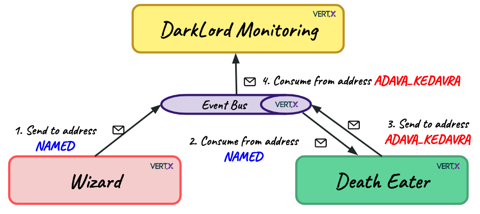

# Harry Potter Vert.x - Taboo Name Curse Application

#### Wizard

Wizards who dare saying the taboo name and being tracked!

#### Death Eater

Consumes the messages from the event bus "NAMED" address.

The Death Eater will be able to go instantly where the Wizard has said the taboo name. 
That's how the Cursed Taboo name works, and that's why you should say "You-Know-Who" or 
"He-Who-Must-Not-Be-Named" or "Dark Lord" if you are a Death Eater. You chose your side, no judgement!

The Death Eater will use the killing curse against the Wizard and come back to report.
A Death Eater can't start a killing curse if it's already doing one!

#### Dark Lord

Consumes monitoring messages from the event bus "ADAVA_KEDAVRA" address and logs them.
The Dark Lord wants to check that Death Eaters are working well.

## Running the application in cluster mode from your IDE

* Run Wizard main `producer.Wizard`
* Run DarkLord main `cosumer.DarkLord`
* Run DeathEater main `consumer.DeathEater`

You can run multiple DeathEaters, and you will see how using the ClusteredLock, curses don't overlap.

## Running from command line

`mvn clean package`

`java -jar target/harry-potter-vertx-1.0-SNAPSHOT-fat.jar run producer.Wizard -cluster`

`java -jar target/harry-potter-vertx-1.0-SNAPSHOT-fat.jar run consumer.DarkLord -cluster`

`java -jar target/harry-potter-vertx-1.0-SNAPSHOT-fat.jar run consumer.DeathEater -cluster`

